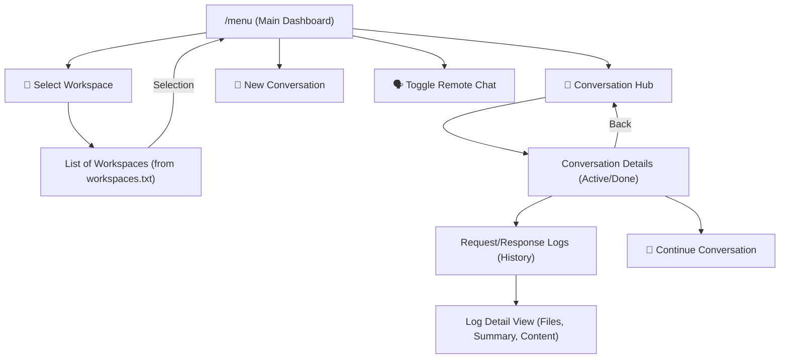

# 🏗️ AG-Uplink: Remote Command Center Architecture

This document describes the internal architecture of the AG-Uplink Telegram MCP Gateway.

## 🧱 Component Overview

AG-Uplink acts as a stateful bridge between the Model Context Protocol (MCP) and the Telegram Bot API.

### 1. Data Model: Workspace -> Conversation -> Interaction
The project follows a tiered hierarchy to manage complex AI workflows:
- **Workspace**: A project container (e.g., "AG-Uplink", "AI-Radar").
- **Conversation**: A specific thread within a workspace (e.g., "Implementing Task Management").
- **Interaction**: A single exchange (Request/Response) within a conversation, containing rich logs and metadata.

### 2. State Management
AG-Uplink uses multiple JSON stores to ensure persistence across restarts:
- `state.json`: Global configuration (Active Workspace, Chat Mode, Message Index).
- `conversations.json`: The core database of all conversations and interaction logs.
- `activity.log`: Sequential record of all Telegram events and bot responses.
- `workspaces.txt`: User-defined entry list for project selection.

### 3. Lifecycle & Threading
The server runs on a single `asyncio` loop with several concurrent workers:
- **MCP Server**: Listens on `stdin/stdout` for JSON-RPC requests from the AI Agent.
- **Polling Worker**: Continuously checks Telegram for new messages and callback queries.
- **Config Watcher**: Monitors `workspaces.txt` for changes and hot-reloads the list without restart.

## 🛠️ MCP Tool Definitions

AG-Uplink exposes its state to the AI Agent via standard MCP tools:

| Tool | Purpose |
| :--- | :--- |
| `send_message` | Sends raw text or structured AI responses to Telegram. |
| `check_telegram_updates` | Pulls new user messages from the buffer since the last check. |
| `get_state` | Provides the Agent with the current active workspace and conversation list. |
| `update_conversation` | Allows the Agent to log its progress and interaction details. |
| `import_conversations` | Bulk-loads conversation descriptors (useful for migration). |

## 📡 Message Flow (Remote Chat Mode)

1. **User** sends a message to Telegram.
2. **Polling Worker** captures the message and appends it to `MESSAGE_BUFFER`.
3. **AI Agent** calls `check_telegram_updates` through the MCP client.
4. **AI Agent** processes the instruction and performs work.
5. **AI Agent** calls `update_conversation` to log technical details.
6. **AI Agent** calls `send_message` to notify the user of completion.

## 🔄 The Antigravity Loop (How "Action" Happens)

Users might wonder why "nothing happens" immediately after a Telegram message is sent. The logic is as follows:
1. **Passive Buffer**: AG-Uplink is a *passive* bridge. It stores your messages but does not execute code itself.
2. **Active Polling**: I (the AI Agent) am the *active* component. I call `check_telegram_updates` at the start of my thinking cycle.
3. **Execution**: Once I read your message from the buffer, I enter my **Execution Mode** to perform the requested changes.
4. **Conclusion**: I then post a new **Interaction Log** to the hub and send a confirmation message.

### ⚡️ Active Mode (Server-Push Experience)

To avoid the "Passive Bridge" delay, you can now toggle **Active Mode**. When I am in this mode:
1. I call `wait_for_remote_instruction` (long-polling).
2. I stay in a "Thinking" state, efficiently waiting for your Telegram messages.
3. As soon as you type on Telegram, I "wake up" immediately and execute the request.
4. This removes the need for any local IDE chat to "wake me up".

### 🔔 The Acknowledgement Flow

When you send a command via Telegram, I (the Agent) will perform the following sequence:
1. **Taking Charge**: I'll send an immediate confirmation: *"🤖 Acknowledged: Processing your instruction..."*
2. **Dashboard Sync**: I'll update the Conversation Hub status to **🟡 In Progress** or **🚀 Executing**.
3. **Mission Complete**: Once finished, I'll send a final summary and update the Hub status to **✅ Done**.

*Note: In Active Mode, your IDE will show me as "Working" while I wait for your remote commands.*

## 🎨 UI & Navigation Logic

AG-Uplink uses a centralized rendering engine for its interactive dashboard:
- **`render_dashboard`**: A unified async function that handles both new message sends and inline edits. This ensures that the state (Chat Mode, Active Workspace) is always visually consistent.
- **Instant Navigation**: Workspace selection callbacks trigger an immediate transition to the dashboard, minimizing the number of clicks required for common tasks.
- **Contextual Markers**: When a user clicks "Continue Conversation", the system appends a hidden `--- CONTEXT FOLLOW-UP ---` marker to the message buffer. This allows the AI Agent to automatically detect which conversation the user is referring to without needing explicit repetition.

## 🌳 Menu Navigation Tree

AG-Uplink uses a tiered navigation system to manage state while maintaining a high-density UI:

### Navigation Rules:
1. **The Root (`/menu`)**: Always provides the absolute state (Active Workspace & Chat Mode).
2. **Instant Redirection**: Any selection in the **Workspace** tree immediately pops the user back to the **Root** to confirm the change.
3. **Log Depth**: Interaction logs are sequestered behind the **Conversation Hub** to keep the dashboard clean.

## 🪟 Sidebar vs. Remote Hub

A common point of confusion is why AG-Uplink conversations do not appear in the **IDE Sidebar**:

1. **IDE Sidebar (Local)**: This is controlled by Antigravity's native project management. It tracks the current session's "Task Boundaries".
2. **Conversation Hub (Remote)**: This is the **Permanent Project Record**. It stores the full history of interactions, technical summaries, and remote commands across all time.
3. **The Sync**: When you send an instruction on Telegram, it appears in your **IDE Inbox** (top left). When I (the Agent) act on it, I create a *Local Task* in the sidebar that matches your *Remote Conversation*.

*Essentially: The Sidebar is my "Active Desk", while the Hub is the "Project Archive".*

---
*Technical Documentation generated by Antigravity.*
